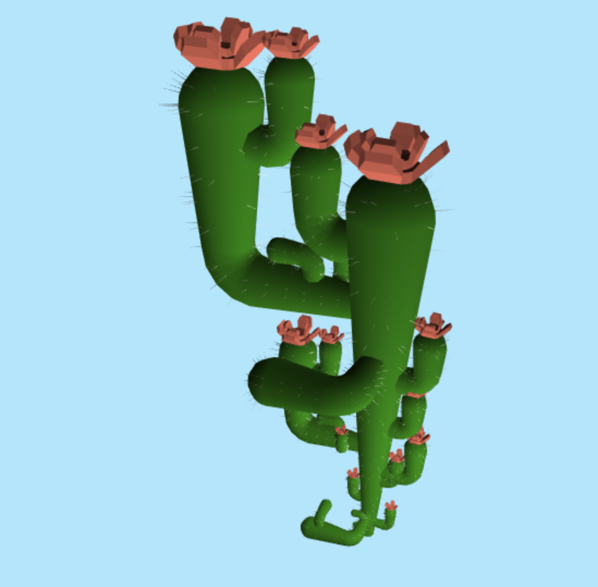

# Homework 4: L-systems
Charles Wang\
PennKey: chawang

[Live Demo] (http://charlesliwang.github.io/homework-4-l-systems-charlesliwang)
(right now the objs don't work so no flowers :()
## Project Overview

This project is a cactus generated using an L-System

Characters that make the L-System:\
A: Extend the branch\
B: Bend the joint\
C: Dummy\
E: Dummy (delays A generation)\
[: Create new branch\
]: End new Branch (cap and top with flower if pointing upwards)
+-*/: Change direction to point in the local "right" or "up" (relative to current direction)

Rules:
A -> ACE\
B -> CAB\
C -> [+ABEA]\
E -> A\
+-*/ -> no change

Other generation rules and implementational details:

First branch can't bend

Radius grows as the branch grows (new branches start with half the radius they broke off from)

Branches are created by appending rings in VBOs and connecting to old faces (so I can get smooth-ish bends)

Growth biases towards "up" as if branches are trying to reach sunlight

Flowers are loaded in by OBJ

 
